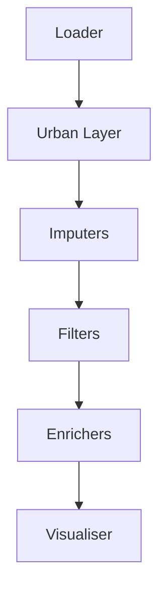

# 🤝 Contributing to  `UrbanMapper` 

Welcome to the `contributing guide` for **UrbanMapper**!  We are excited to collaborate on developing a tool for urban
data analysis that is both accessible and powerful. This guide will help you set up your environment, add new
components, and submit contributions. Whether you are `fixing bugs`, `adding features`, or `improving documentation`, your
work is important!

!!! important "Status of  `UrbanMapper` "
     `UrbanMapper`  is actively evolving. Expect changes, and if you hit a snag, open a GitHub Issue—we’re here to help!

!!! tip "New Contributors"
    Check out the [GitHub Issues](https://github.com/VIDA-NYU/UrbanMapper/issues) for good first tasks or reach out for guidance!

---

## 🛠️ Environment Setup

Get started by setting up your development environment. We recommend `uv` for its speed, but `pip` or `conda` work too.

### Prerequisites

- **Install `uv`**: Grab it from the [official guide](https://docs.astral.sh/uv/getting-started/installation/).

### Steps

1. **Clone the Repo**:
   ```bash
   git clone git@github.com:VIDA-NYU/UrbanMapper.git
   cd UrbanMapper
   ```

2. **Sync Dependencies**:
   ```bash
   uv lock
   uv sync
   ```

3. **(Optional) Add Jupyter Extensions** for visualizations:
   ```bash
   uv run jupyter labextension install @jupyter-widgets/jupyterlab-manager
   ```

4. **Launch Jupyter Lab**:
   ```bash
   uv run --with jupyter jupyter lab
   ```

- **Config Note**: Check out `config.yaml` in `urban_mapper/` for pipeline schemas and mixin mappings. It’s optional for
  basic setup but key for advanced tweaks.

!!! tip "Alternative Tools"
    Prefer `pip` or `conda`? That’s fine—just note `uv` is our go-to for performance.

---

## 🧹 Linting and Formatting with Ruff

We use `ruff` to keep the codebase clean and consistent. Run it before submitting changes.

### Commands

- **Check Issues**:
  ```bash
  uv run ruff check
  ```
- **Fix Formatting**:
  ```bash
  uv run ruff check --fix
  ```

!!! tip "Editor Integration"
    Integrate `ruff` into your editor (e.g., VSCode) for live feedback.

---

## 🔒 Pre-Commit Hooks

Pre-commit hooks enforce standards by running checks (like `ruff`) before commits.

### Setup

1. **Install**:
   ```bash
   uv run pre-commit install
   ```
2. **Test Manually** (optional):
   ```bash
   uv run pre-commit run --all-files
   ```

!!! note "Automatic Execution"
    Hooks run automatically on `git commit`. Fix any failures to proceed.

---

## 🧩 How to Create New Components

 `UrbanMapper` ’s modular design makes extending it a breeze. Select the component type you want to add:

=== "Loader"

    Loaders pull data (e.g., CSV, Shapefiles) into a `GeoDataFrame`{ title="A GeoDataFrame is a pandas DataFrame with geospatial capabilities." }.

    1. **Subclass `LoaderBase`** (`urban_mapper/modules/loader/abc_loader.py`):
        - Implement `load_data_from_file`. Refer to the `base` class for details.
    2. **Register It**:
        - Add to `FILE_LOADER_FACTORY` in `urban_mapper/modules/loader/loader_factory.py`.

    **Example** (`csv_loader.py`):
    ```python
    from urban_mapper.modules.loader.abc_loader import LoaderBase
    import geopandas as gpd
    import pandas as pd
    from beartype import beartype

    @beartype
    class CSVLoader(LoaderBase):
        def load_data_from_file(self) -> gpd.GeoDataFrame:
            df = pd.read_csv(self.file_path)  #(1)
            # Convert to GeoDataFrame...
            return gdf

    ```

    1. Reads the CSV file into a pandas DataFrame before geospatial conversion.

    - Place in `urban_mapper/modules/loader/loaders/`.

=== "Urban Layer"

    Urban layers (e.g., streets) are spatial entities as `GeoDataFrames`.

    1. **Subclass `UrbanLayerBase`** (`urban_mapper/modules/urban_layer/abc_urban_layer.py`):
       - Add methods like `from_place` and `_map_nearest_layer`. Refer to the `base` class for details.

    **Example** (`osmnx_streets.py`):
    ```python
    from urban_mapper.modules.urban_layer.abc_urban_layer import UrbanLayerBase
    import geopandas as gpd
    import osmnx as ox
    from beartype import beartype

    @beartype
    class OSMNXStreets(UrbanLayerBase):
        def from_place(self, place_name: str, **kwargs) -> None:
            self.network = ox.graph_from_place(place_name, network_type="all")  # (1)
            self.layer = ox.graph_to_gdfs(self.network)[1].to_crs(self.coordinate_reference_system)

    ```

    1. Fetches street network data using OSMnx for the specified place.

    - Place in `urban_mapper/modules/urban_layer/urban_layers/`.
    - Auto-detected—no registration needed.

=== "Imputer"

    Imputers fill missing geospatial data, such as gaps in a dataset.

    1. **Subclass `GeoImputerBase`** (`urban_mapper/modules/imputer/abc_imputer.py`):
       - Implement `_transform` and `preview`. Refer to the `base` class for details.

    **Example** (`simple_geo_imputer.py`):
    ```python
    from urban_mapper.modules.imputer.abc_imputer import GeoImputerBase
    import geopandas as gpd
    from beartype import beartype

    @beartype
    class SimpleGeoImputer(GeoImputerBase):
        def _transform(self, input_geodataframe: gpd.GeoDataFrame, urban_layer) -> gpd.GeoDataFrame:
            # Impute logic here
            return input_geodataframe
        def preview(self, format: str = "ascii") -> str:
            return f"Imputer: SimpleGeoImputer\n  Lat: {self.latitude_column}"
    ```

    - Place in `urban_mapper/modules/imputer/imputers/`.
    - Auto-detected.

=== "Filter"

    Filters refine datasets (e.g., by spatial bounds).

    1. **Subclass `GeoFilterBase`** (`urban_mapper/modules/filter/abc_filter.py`):
       - Implement `_transform`. Refer to the `base` class for details.

    **Example** (`bounding_box_filter.py`):
    ```python
    from urban_mapper.modules.filter.abc_filter import GeoFilterBase
    import geopandas as gpd
    from beartype import beartype

    @beartype
    class BoundingBoxFilter(GeoFilterBase):
        def _transform(self, input_geodataframe: gpd.GeoDataFrame, urban_layer) -> gpd.GeoDataFrame:
            minx, miny, maxx, maxy = urban_layer.get_layer_bounding_box()
            return input_geodataframe.cx[minx:maxx, miny:maxy]
    ```

    - Place in `urban_mapper/modules/filter/filters/`.
    - Auto-detected.

=== "Enricher / Aggregator"

    Enrichers enhance urban layers with insights; aggregators summarise data.

    **Enrichers**:

    - **Subclass `EnricherBase`** (`urban_mapper/modules/enricher/abc_enricher.py`).
    - Place in `urban_mapper/modules/enricher/enrichers/`.
    - Auto-detected.

    **Aggregators**:

    - **Subclass `BaseAggregator`** (`urban_mapper/modules/enricher/aggregator/abc_aggregator.py`).
    - Update `EnricherFactory.build()` in `urban_mapper/modules/enricher/enricher_factory.py`.

    **Example** (`sum_aggregator.py`):
    ```python
    from urban_mapper.modules.enricher.aggregator.abc_aggregator import BaseAggregator
    import pandas as pd
    from beartype import beartype

    @beartype
    class SumAggregator(BaseAggregator):
        def __init__(self, group_by_column: str, value_column: str):
            self.group_by_column = group_by_column
            self.value_column = value_column
        def _aggregate(self, input_dataframe: pd.DataFrame) -> pd.Series:
            return input_dataframe.groupby(self.group_by_column)[self.value_column].sum()
    ```

    - Place in `urban_mapper/modules/enricher/aggregator/aggregators/`.
    - Add to `EnricherFactory`:
      ```python
      elif self.config.action == "sum":
          aggregator = SumAggregator(self.config.group_by[0], self.config.values_from[0])
      ```

=== "Visualiser"

    Visualisers render maps for analysis.

    1. **Subclass `VisualiserBase`** (`urban_mapper/modules/visualiser/abc_visualiser.py`):
       - Implement `_render`. Refer to the `base` class for details.

    **Example** (`static_visualiser.py`):
    ```python
    from urban_mapper.modules.visualiser.abc_visualiser import VisualiserBase
    import geopandas as gpd
    from beartype import beartype

    @beartype
    class StaticVisualiser(VisualiserBase):
        def _render(self, urban_layer_geodataframe: gpd.GeoDataFrame, columns: list, **kwargs):
            return urban_layer_geodataframe.plot(column=columns[0], legend=True, **kwargs).get_figure()
    ```

    - Place in `urban_mapper/modules/visualiser/visualisers/`.
    - Auto-detected.

=== "Pipeline Generator"

    Generators create pipeline steps dynamically.

    1. **Subclass `PipelineGeneratorBase`** (`urban_mapper/modules/pipeline_generator/abc_pipeline_generator.py`).

    **Example** (`gpt4o_pipeline_generator.py`):
    ```python
    from urban_mapper.modules.pipeline_generator.abc_pipeline_generator import PipelineGeneratorBase
    from beartype import beartype

    @beartype
    class GPT4OPipelineGenerator(PipelineGeneratorBase):
        def generate_pipeline(self, data_description: str) -> list:
            # AI-driven step generation
            return []
    ```

    - Place in `urban_mapper/modules/pipeline_generator/generators/`.
    - Auto-detected via `pipeline_generator_factory.py`.

---

## 🏗️ Pipeline Architecture

 `UrbanMapper` ’s pipeline flows like this:



Each step processes the data sequentially, transforming it from raw input to enriched urban insights. New components
should slot into this sequence (see `urban_mapper/pipeline/`).

---

## 📝 Generate Documentation

First and foremost, thank you for your contribution! To generate documentation, follow these steps:

1. **UV Sync with DEV**:
   ```bash
   uv sync --dev
   ```
   
2. **Build Docs**:
   ```bash
   ./build_docs.sh
   ```
   
3. **Serve Docs**:
   ```bash
    uv run mkdocs serve
    ```
   
4. **Open in Browser**:

    [Localhost :fontawesome-solid-paper-plane:](http://127.0.0.1:8000){ .md-button }

---

## 📬 Pull Requests and Rebasing

- **Branch**:
   ```bash
   git checkout -b feat/your-feature
   ```
- **Commit**:
    - Use Git Karma style (e.g., `feat: add new loader`).
- **Rebase**:
   ```bash
   git fetch origin
   git rebase origin/main
   ```
- **Submit PR**:
    - Push and open a PR against `main`.
    - **Note**: We suggest [Git Karma](https://example.com/git-karma) for commits/branches (e.g., `feat/add-loader`),
      but it’s optional unless CI enforces it.

### Common Git Commands

| Command                    | Description                           |
|----------------------------|---------------------------------------|
| `git clone <url>`          | Clone the repository                  |
| `git checkout -b <name>`   | Create and switch to a new branch     |
| `git add <files>`          | Stage changes for commit              |
| `git commit -m "<msg>"`    | Commit changes with a message         |
| `git push origin <branch>` | Push changes to the remote repository |
| `git fetch origin`         | Fetch latest changes from remote      |
| `git rebase origin/main`   | Rebase your branch on top of main     |

!!! tip "Git Hints"
    Use `git rebase -i` to polish commits, but don’t rewrite shared history.

---

## 🎉 Thank You!

Thanks for contributing to  `UrbanMapper` ! Your efforts shape urban data analysis. Questions? Open an issue—we’ve got your
back.

Happy mapping! 🌍