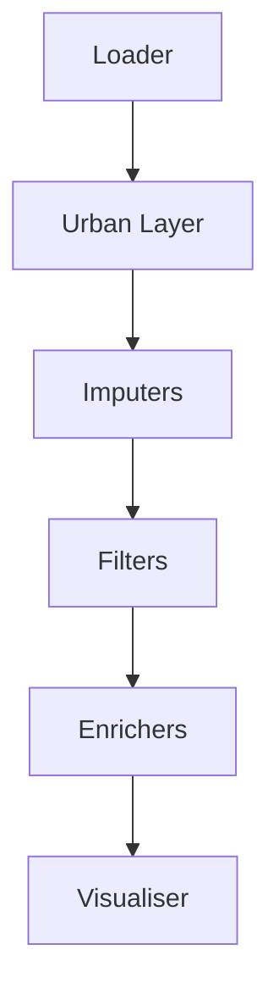

# 🤝 Contributing to `UrbanMapper`

Welcome to the `contributing guide` for **UrbanMapper**! We are excited to collaborate on developing a tool for urban
data analysis that is both accessible and powerful. This guide will help you set up your environment, add new
components, and submit contributions. Whether you are `fixing bugs`, `adding features`, or `improving documentation`,
your work is important!

!!! important "Status of `UrbanMapper`"
    `UrbanMapper` is actively evolving. Expect changes, and if you hit a snag, open a GitHub Issue—we’re here to help!

!!! tip "New Contributors"
    Check out the [GitHub Issues](https://github.com/VIDA-NYU/UrbanMapper/issues) for good first tasks or reach out for
    guidance!

---

## 🛠️ Project Setup Guide 

### Prerequisites

- `UrbanMapper` requires Python `3.10` or higher.
- Use ``uv`` (recommended), ``conda``, or ``venv`` to manage your project setup. Follow the steps below to install one of them.

    === "uv (Recommended)"

        - To install `uv`, follow the instructions on the [uv documentation](https://docs.astral.sh/uv/getting-started/installation/).
        - If you don’t have Python `3.10` or higher / you prefer to be sure, you can install and pin it using uv:
        ```bash
        uv python install 3.10
        uv python pin 3.10
        ```

    === "conda"

        - To install `conda`, follow the instructions on the [conda documentation](https://docs.conda.io/projects/conda/en/latest/user-guide/install/index.html).
        - If you don’t have Python `3.10` or higher, you can create a new conda environment with the required version:
        ```bash
        conda create -n urbanmapper python=3.10
        conda activate urbanmapper
        ```

    === "venv"

        - Ensure you have Python `3.10` or higher installed. You can check your Python version with:
        ```bash
        python3 --version
        ```
        - To create a virtual environment, use Python's built-in `venv` module:
        ```bash
        python3 -m venv urbanmapper-env
        source urbanmapper-env/bin/activate  # On macOS/Linux
        urbanmapper-env\Scripts\activate     # On Windows
        ```

### Clone the Repo
   ```bash
   git clone git@github.com:VIDA-NYU/UrbanMapper.git
   cd UrbanMapper
   ```

### Environment Setup

Get started by setting up your development environment. We recommend `uv` for its speed, but `pip` or `conda` work too. Choose one of the following options:

=== "Using uv (Recommended)"

    1. **Lock and sync dependencies**:
    ```bash
    uv lock
    uv sync
    ```
    **Note**: If you encounter errors related to 'cairo' during dependency installation, see the [Troubleshooting](#troubleshooting) section.
    
    2. **(Recommended) Install Jupyter extensions** for interactive visualisations requiring Jupyter widgets:
    ```bash
    uv run jupyter labextension install @jupyter-widgets/jupyterlab-manager
    ```

    3. **Launch Jupyter Lab** to explore `UrbanMapper` (faster than running Jupyter without uv):
    ```bash
    uv run --with jupyter jupyter lab
    ```

    !!! tip "UV's readings recommendations:"
        - [Python Packaging in Rust](https://astral.sh/blog/uv)
        - [A Year of UV](https://www.bitecode.dev/p/a-year-of-uv-pros-cons-and-should)
        - [UV Is All You Need](https://dev.to/astrojuanlu/python-packaging-is-great-now-uv-is-all-you-need-4i2d)
        - [State of the Art Python 2024](https://4zm.org/2024/10/28/state-of-the-art-python-in-2024.html)
        - [Data Scientist, From School to Work](https://towardsdatascience.com/data-scientist-from-school-to-work-part-i/)

=== "Using pip"

    If you prefer not to use `uv`, you can install `UrbanMapper` using `pip`. This method is slower and requires more manual intervention.

    **Assumptions**:

    - You have `pip` installed.
    - You are working within a virtual environment or a conda environment.
    !!! note
        If you are not using a virtual or conda environment, it is highly recommended to set one up to avoid conflicts. Refer to [Python's venv documentation](https://docs.python.org/3/library/venv.html) or [conda's environment management guide](https://docs.conda.io/projects/conda/en/latest/user-guide/tasks/manage-environments.html) for assistance.

    1. **Install dependencies**:
    ```bash
    pip install -r requirements.txt
    ```
    2. **Install `UrbanMapper`**:
    ```bash
    pip install -e ./UrbanMapper
    # or if you ensure you are in your virtual environment, cd UrbanMapper && pip install -e .
    ```
    The `-e` flag installs `UrbanMapper` in editable mode, allowing changes to the code to be reflected immediately. If you don’t need this, use `pip install ./UrbanMapper` instead.
        
    3. **(Recommended) Install Jupyter extensions** for interactive visualisations:
    ```bash
    jupyter labextension install @jupyter-widgets/jupyterlab-manager
    ```

    4. **Launch Jupyter Lab**:
    ```bash
    jupyter lab
    ```

### Config Note:
Check out `config.yaml` in `urban_mapper/` for pipeline schemas and mixin mappings. It’s optional for basic setup but key for advanced tweaks.

!!! tip "Alternative Tools"
    Prefer `pip` or `conda`? That’s fine—just note `uv` is our go-to for performance.

---

## 🧹 Linting and Formatting with Ruff

We use `ruff` to keep the codebase clean and consistent. Run it before submitting changes.

### Commands

- **Check Issues**:
  ```bash
  uv run ruff check
  ```
- **Fix Formatting**:
  ```bash
  uv run ruff check --fix
  ```

!!! tip "Editor Integration"
    Integrate `ruff` into your editor (e.g., VSCode) for live feedback.

---

## 🔒 Pre-Commit Hooks

Pre-commit hooks enforce standards by running checks (like `ruff`) before commits.

### Setup

1. **Install**:
   ```bash
   uv run pre-commit install
   ```
2. **Test Manually** (optional):
   ```bash
   uv run pre-commit run --all-files
   ```

!!! note "Automatic Execution"
    Hooks run automatically on `git commit`. Fix any failures to proceed.

---

## 🧩 How to Create New Components

`UrbanMapper`’s modular design makes extending it a breeze. Select the component type you want to add:

=== "Loader"

    Loaders pull data (e.g., CSV, Shapefiles) into a `GeoDataFrame`{ title="A GeoDataFrame is a pandas DataFrame with geospatial capabilities." }.

    1. **Subclass `LoaderBase`** (`urban_mapper/modules/loader/abc_loader.py`):
        - Implement `load_data_from_file`. Refer to the `base` class for details.
    2. **Register It**:
        - Add to `FILE_LOADER_FACTORY` in `urban_mapper/modules/loader/loader_factory.py`.

    **Example** (`csv_loader.py`):
    ```python
    from urban_mapper.modules.loader.abc_loader import LoaderBase
    import geopandas as gpd
    import pandas as pd
    from beartype import beartype

    @beartype
    class CSVLoader(LoaderBase):
        def load_data_from_file(self) -> gpd.GeoDataFrame:
            df = pd.read_csv(self.file_path)  #(1)
            # Convert to GeoDataFrame...
            return gdf
    ```

    1. Reads the CSV file into a pandas DataFrame before geospatial conversion.

    - Place in `urban_mapper/modules/loader/loaders/`.

=== "Urban Layer"

    Urban layers (e.g., streets) are spatial entities as `GeoDataFrames`.

    1. **Subclass `UrbanLayerBase`** (`urban_mapper/modules/urban_layer/abc_urban_layer.py`):
       - Add methods like `from_place` and `_map_nearest_layer`. Refer to the `base` class for details.

    **Example** (`osmnx_streets.py`):
    ```python
    from urban_mapper.modules.urban_layer.abc_urban_layer import UrbanLayerBase
    import geopandas as gpd
    import osmnx as ox
    from beartype import beartype

    @beartype
    class OSMNXStreets(UrbanLayerBase):
        def from_place(self, place_name: str, **kwargs) -> None:
            self.network = ox.graph_from_place(place_name, network_type="all")  # (1)
            self.layer = ox.graph_to_gdfs(self.network)[1].to_crs(self.coordinate_reference_system)
    ```

    1. Fetches street network data using OSMnx for the specified place.

    - Place in `urban_mapper/modules/urban_layer/urban_layers/`.
    - Auto-detected—no registration needed.

=== "Imputer"

    Imputers fill missing geospatial data, such as gaps in a dataset.

    1. **Subclass `GeoImputerBase`** (`urban_mapper/modules/imputer/abc_imputer.py`):
       - Implement `_transform` and `preview`. Refer to the `base` class for details.

    **Example** (`simple_geo_imputer.py`):
    ```python
    from urban_mapper.modules.imputer.abc_imputer import GeoImputerBase
    import geopandas as gpd
    from beartype import beartype

    @beartype
    class SimpleGeoImputer(GeoImputerBase):
        def _transform(self, input_geodataframe: gpd.GeoDataFrame, urban_layer) -> gpd.GeoDataFrame:
            # Impute logic here
            return input_geodataframe        def preview(rmat: s        r = "-> str::
    s        r     return f"Imputer: Simpl:s        r     eGeoImputer\n  Lat: {self.la:titude_column}"
    ```

    - Place: in `urban_mapper/modules/imputer/imputers/`.
    - Auto-detected.

=== "Filter"

    Filters refine datasets (e.g., by spatial bounds).

    1. **Subclass `GeoFilterBase`** (`urban_mapper/modules/filter/abc_filter.py`):
       - Implement `_transform`. Refer to the `base` class for details.

    **Example** (`bounding_box_filter.py`):
    ```python
    from urban_mapper.modules.filter.abc_filter import GeoFilterBase
    import geopandas as gpd
    from beartype import beartype

    @beartype
    class BoundingBoxFilter(GeoFilterBase):
        def _transform(self, input_geodataframe: gpd.GeoDataFrame, urban_layer) -> gpd.GeoDataFrame:
            minx, miny, maxx, maxy = urban_layer.get_layer_bounding_box()
            return input_geodataframe.cx[minx:maxx, miny:maxy]
    ```

    - Place in `urban_mapper/modules/filter/filters/`.
    - Auto-detected.

=== "Enricher / Aggregator"

    Enrichers enhance urban layers with insights; aggregators summarise data.

    **Enrichers**:

    - **Subclass `EnricherBase`** (`urban_mapper/modules/enricher/abc_enricher.py`).
    - Place in `urban_mapper/modules/enricher/enrichers/`.
    - Auto-detected.

    **Aggregators**:

    - **Subclass `BaseAggregator`** (`urban_mapper/modules/enricher/aggregator/abc_aggregator.py`).
    - Update `EnricherFactory.build()` in `urban_mapper/modules/enricher/enricher_factory.py`.

    **Example** (`sum_aggregator.py`):
    ```python
    from urban_mapper.modules.enricher.aggregator.abc_aggregator import BaseAggregator
    import pandas as pd
    from beartype import beartype

    @beartype
    class SumAggregator(BaseAggregator):
        def __init__(self, group_by_column: str, value_column: str):
            self.group_by_column = group_by_column
            self.value_column = value_column
        def _aggregate(self, input_dataframe: pd.DataFrame) -> pd.Series:
            return input_dataframe.groupby(self.group_by_column)[self.value_column].sum()
    ```

    - Place in `urban_mapper/modules/enricher/aggregator/aggregators/`.
    - Add to `EnricherFactory`:
      ```python
      elif self.config.action == "sum":
          aggregator = SumAggregator(self.config.group_by[0], self.config.values_from[0])
      ```

=== "Visualiser"

    Visualisers render maps for analysis.

    1. **Subclass `VisualiserBase`** (`urban_mapper/modules/visualiser/abc_visualiser.py`):
       - Implement `_render`. Refer to the `base` class for details.

    **Example** (`static_visualiser.py`):
    ```python
    from urban_mapper.modules.visualiser.abc_visualiser import VisualiserBase
    import geopandas as gpd
    from beartype import beartype

    @beartype
    class StaticVisualiser(VisualiserBase):
        def _render(self, urban_layer_geodataframe: gpd.GeoDataFrame, columns: list, **kwargs):
            return urban_layer_geodataframe.plot(column=columns[0], legend=True, **kwargs).get_figure()
    ```

    - Place in `urban_mapper/modules/visualiser/visualisers/`.
    - Auto-detected.

=== "Pipeline Generator"

    Generators create pipeline steps dynamically.

    1. **Subclass `PipelineGeneratorBase`** (`urban_mapper/modules/pipeline_generator/abc_pipeline_generator.py`).

    **Example** (`gpt4o_pipeline_generator.py`):
    ```python
    from urban_mapper.modules.pipeline_generator.abc_pipeline_generator import PipelineGeneratorBase
    from beartype import beartype

    @beartype
    class GPT4OPipelineGenerator(PipelineGeneratorBase):
        def generate_pipeline(self, data_description: str) -> list:
            # AI-driven step generation
            return []
    ```

    - Place in `urban_mapper/modules/pipeline_generator/generators/`.
    - Auto-detected via `pipeline_generator_factory.py`.

---

## 🏗️ Pipeline Architecture

`UrbanMapper`’s pipeline flows like this:



Each step processes the data sequentially, transforming it from raw input to enriched urban insights. New components
should slot into this sequence (see `urban_mapper/pipeline/`).

---

## 📝 Generate Documentation

First and foremost, thank you for your contribution! To generate documentation, follow these steps:

1. **UV Sync with DEV**:
   ```bash
   uv sync --dev
   ```

2. **Build Docs**:
   ```bash
   ./build_docs.sh
   ```

3. **Serve Docs**:
   ```bash
   uv run mkdocs serve
   ```

4. **Open in Browser**:
   [Localhost :fontawesome-solid-paper-plane:](http://127.0.0.1:8000){ .md-button }

**Note**: During documentation generation, ensure your environment is correctly set up. If you encounter issues with
dependencies like 'cairo', refer to the [Troubleshooting](#troubleshooting) section. If you’ve added new packages,
update the requirements files as described in [Managing Dependencies](#managing-dependencies).

---

## 📬 Pull Requests and Rebasing

- **Branch**:
   ```bash
   git checkout -b feat/your-feature
   ```
- **Commit**:
    - Use Git Karma style (e.g., `feat: add new loader`).
- **Rebase**:
   ```bash
   git fetch origin
   git rebase origin/main
   ```
- **Submit PR**:
    - Push and open a PR against `main`.
    - **Note**: We highly encourage using [Git Karma](https://example.com/git-karma) for commits/branches (e.g., `feat/add-loader`).

!!! warning "PR for the being are merge commits without squashing"
    We are currently using merge commits without squashing. This may change when `UM` becomes more stable.
    Therefore, make sure your history is clean enough and does not provide a spaghetti-style history.

    Interested in further readings? Look [here](https://simonprovostdev.vercel.app/blog/fd082ab2-d5ca-4e09-b5d7-b8b808fbd639/an-excellent-technique-to-keep-a-git-branch-tidy-%F0%9F%A7%BC).


### Common Git Commands

| Command                    | Description                           |
|----------------------------|---------------------------------------|
| `git clone <url>`          | Clone the repository                  |
| `git checkout -b <name>`   | Create and switch to a new branch     |
| `git add <files>`          | Stage changes for commit              |
| `git commit -m "<msg>"`    | Commit changes with a message         |
| `git push origin <branch>` | Push changes to the remote repository |
| `git fetch origin`         | Fetch latest changes from remote      |
| `git rebase origin/main`   | Rebase your branch on top of main     |

!!! tip "Git Hints"
    - [x] Use `git rebase -i` to polish commits, but don’t rewrite shared history.
    - [x] We may request history rewritting for clarity. Beginner to fixup ? Read this nice article: https://github.com/TheAssemblyArmada/Thyme/wiki/Using-Fixup-Commits
    - [x] Want to have a nice look at your logs? Use `Tig` to visualize your git history. Install it via `brew install tig` and run `tig` in your terminal.

---

## 🎉 Thank You!

Thanks for contributing to `UrbanMapper`! Your efforts shape urban data analysis. Questions? Open an issue—we’ve got
your back.

Happy mapping! 🌍

---

## Troubleshooting

### Handling 'cairo' Dependency Issues

!!! warning
    On MacOS, if you encounter errors related to 'cairo', follow these steps:

    Source: [https://github.com/squidfunk/mkdocs-material/issues/5121](https://github.com/squidfunk/mkdocs-material/issues/5121).

    1. Install 'cairo' if not already installed:
       ```bash
       brew install cairo
       ```
    2. If already installed, try reinstalling:
       ```bash
       brew reinstall cairo
       ```
    3. If the symlink is broken, fix it:
       ```bash
       brew link cairo
       ```
       Or:
       ```bash
       brew unlink cairo && brew link cairo
       ```
    4. For MacOS with M2 and before (Intel included):
       - Set the environment variable:
         ```bash
         export DYLD_FALLBACK_LIBRARY_PATH=/opt/homebrew/lib
         ```
    4. For MacOS with M3 chip or later:
       - Create a symbolic link:
         ```bash
         ln -s /opt/homebrew/lib/libcairo.2.dylib .
         ```

    **Note**: These steps have been tested on MacOS. For Windows or Linux, adapt accordingly or open a GitHub issue.

---

## Managing Dependencies

When you add a new package to the project, update the requirements files as follows:

1. **Update `requirements.txt`** –– Mainly for the people who are using `pip` or `conda` to install the dependencies.
   ```bash
   uv pip compile pyproject.toml -o requirements.txt
   ```
   Note that this step will vanish after the first release of UrbanMapper on PyPi.
   Meanwhile, if you want to know more about why we should do that and, why not `UV` is automatically doing that:
   [https://github.com/astral-sh/uv/issues/6007](https://github.com/astral-sh/uv/issues/6007). Happy reading 💪!

   2. **Update `requirements-dev.txt`** –– Mainly for the newly generated documentation via ReadTheDoc.
      ```bash
      uv export --dev --no-hashes --no-header --no-annotate | awk '{print $1}' FS=' ;' > requirements-dev.txt
      ```
   
      Then, manually adjust for platform-specific dependencies. Locate lines like:
      ```
      pywin32==310
      pywin32-ctypes==0.2.3
      pywinpty==2.0.15
      ```
   
      Replace them with:
      ```
      pywin32==310; platform_system=="Windows"
      pywin32-ctypes==0.2.3; platform_system=="Windows"
      pywinpty==2.0.15; platform_system=="Windows"
      ```
   
      Note that this manual adjustment is needed for Read The Docs, which does not yet support `uv`. See the ongoing
      discussion at [https://github.com/astral-sh/uv/issues/10074](https://github.com/astral-sh/uv/issues/10074).

3. **Commit and Push**:
   After updating, commit and push the changes to the repository.
