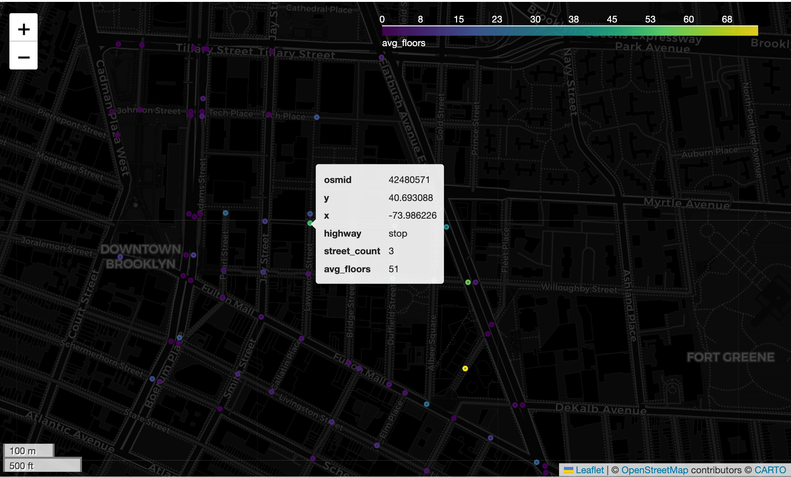

# 🌇 `Getting Started Step-By-Step` guide!

!!! warning "This is the first entry point out of how to get started with `UrbanMapper`"
    This guide is designed to help you quickly get up and running with `UrbanMapper`.
    It provides a step-by-step walkthrough of the basic functionalities and features of `UrbanMapper`,
    allowing you to explore its capabilities and understand how to use it effectively.
    Nonetheless, a second getting started example is available with a more concise way that what's presented below,
    i.e. in a pipeline manner. Feel free to walk through the Getting Started W/ Pipeline page.

To get started, we'll pick the `PLUTO` dataset, a comprehensive land use and geographic dataset at the tax lot level,
which contains over seventy fields derived from data maintained by city agencies. This dataset is adequate enough for
urban analysis, and we will use it to explore the `Downtown Brooklyn` area in New York City. More specifically, we will
be using the `PLUTO` dataset to create an interactive map that visualises the average number of building floors per
intersection in the `Downtown Brooklyn, New York City, USA` area.

_Dataset's source:_
> PLUTO: Extensive land use and geographic data at the tax lot level. The PLUTO files contain more than seventy fields
> derived from data maintained by city agencies.

- PLUTO data from [NYC Open Data](https://www.nyc.gov/content/planning/pages/resources/datasets/mappluto-pluto-change).

!!! tip "Download all data without complicating yourself?"
    You also can download the public datasets used throughout all examples including this current's one via two channels.
    
    - **Channel 1: Our Google Drive public folder**
        - **Option A:** Download all datasets at once using the command:
                ```bash
                # If you do not have gdown installed, install it first
                # brew install gdown or pip install gdown
                gdown https://drive.google.com/drive/folders/1n-5zkNqT97W-I9Dc7X_mG4kezskfVtlb -O ./data --folder
                ```
        - **Option B:** Manually download specific datasets from the same Google Drive folder on demand.
     - **Channel 2: Official data sources**
         - Follow the data source links provided in the various notebooks.
         - Download the datasets directly from their official channels.
         - Place the downloaded files in the `data/` folder or any other folder of your choice.
    
       Voila! You are ready to go! 🎉

Step-by-step, you’ll learn how to:

- **Loading** the PLUTO dataset from a `CSV` file to kickstart your analysis.
- **Creating** a `street intersections layer` for `Downtown Brooklyn` as your urban foundation.
- **Imputing** missing `longitude` and `latitude` coordinates to keep your data complete.
- **Filtering** the dataset to focus solely on the area data points that matters.
- **Mapping** `data points` to their` nearest intersections` for spatial joint prior enriching/augmenting.
- **Enriching** the layer with insights, like the `average number of building floors per intersection`.
- **Visualising** your results on an `interactive map` to bring the data to life.

Each step comes with clear explanations of its purpose and how the data evolves, giving you a front-row seat to
`UrbanMapper`’s workflow. Whether you’re new to urban data analysis or looking to streamline your skills,
this guide—built around the PLUTO dataset from NYC Open Data—has you covered. Let’s dive in and start mapping!

## Final Viz



## Import & Instantiate an instance of `UrbanMapper`
```python
import urban_mapper as um

# Initialise UrbanMapper
mapper = um.UrbanMapper()
```

## Step 1: Load Data

**Goal**: Load the PLUTO dataset to begin our analysis.

**Input**: A CSV file path (`./pluto.csv`) containing PLUTO data with columns like `longitude`, `latitude`, and
`numfloors`. Replace with your own csv filepath here.

**Output**: A GeoDataFrame (`gdf`) with the loaded data, tagged with longitude and latitude columns for geospatial
analysis.

Here, we use the `loader` module to read the CSV and specify the coordinate columns, making the data ready for
geospatial operations.

```python
data = (
    mapper
    .loader
    .from_file("./pluto.csv")
    .with_columns(longitude_column="longitude", latitude_column="latitude")
    .load()
)
data.head(10)  # Preview the first ten rows
```

## Step 2: Create Urban Layer

**Goal**: Build a foundational layer of street intersections in `Downtown Brooklyn` to map our data onto.

**Input**: A place name (`Downtown Brooklyn, New York City, USA`) and mapping configuration (`longitude`, `latitude`,
`output column`, and `threshold distance`).

**Output**: An `UrbanLayer` object representing street intersections, ready to associate data points with specific
intersections.

We use the `urban_layer` module with type `streets_intersections`, fetch the network via OSMnx (using `drive` network
type), and configure mapping to assign data points to the nearest intersection within 50 meters.

```python
layer = (
    mapper
    .urban_layer
    .with_type("streets_intersections")
    .from_place("Downtown Brooklyn, New York City, USA", network_type="drive")
    .with_mapping(
        longitude_column="longitude",
        latitude_column="latitude",
        output_column="nearest_intersection",
        threshold_distance=50, # Optional.
    )
    .build()
)
layer.static_render()  # Visualise the plain intersections statically (Optional)
```

## Step 3: Impute Missing Data

**Goal**: Fill in missing `longitude` and `latitude` values to ensure all data points can be mapped and played with.

**Input**: The GeoDataFrame from Step 1 (with potential missing coordinates) and the urban layer from Step 2.

**Output**: A GeoDataFrame with imputed coordinates, reducing missing values.

The `SimpleGeoImputer` from the `imputer` module removes records that simply are having missing coordinates (naive
way) –– Further look in the documentation for more. We check missing values before and after to see the effect.

```python
print(f"Missing before: {data[['longitude', 'latitude']].isna().sum()}")
imputed_data = (
    mapper
    .imputer
    .with_type("SimpleGeoImputer")
    .on_columns(longitude_column="longitude", latitude_column="latitude")
    .transform(data, layer)
)
print(f"Missing after: {imputed_data[['longitude', 'latitude']].isna().sum()}")
```

## Step 4: Filter Data

**Goal**: Narrow down the data to only points within Downtown Brooklyn’s bounds.

**Input**: The imputed GeoDataFrame from Step 3 and the urban layer from Step 2.

**Output**: A filtered GeoDataFrame containing only data within the layer’s bounding box.

Using the `BoundingBoxFilter` from the `filter` module, we trim the dataset to match the spatial extent of our
intersections layer, reducing irrelevant data.

```python
print(f"Rows before: {len(imputed_data)}")
filtered_data = (
        mapper
        .filter
        .with_type("BoundingBoxFilter")
        .transform(imputed_data, layer)
)
print(f"Rows after: {len(filtered_data)}")
```

## Step 5: Map to Nearest Layer

**Goal**: Link each data point to its nearest street intersection so later on we could enrich the intersections with
some basic aggregations or geo-statistics.

**Input**: The filtered GeoDataFrame from Step 4.

**Output**: An updated `UrbanLayer` and a GeoDataFrame with a new `nearest_intersection` column indicating the closest
intersection for each point.

The `map_nearest_layer` method uses the mapping configuration from Step 2 to associate data points with intersections,
enabling spatial aggregation in the next step.

```python
_, mapped_data = layer.map_nearest_layer(filtered_data)  # Outputs both the layer (unnecessary here) and the mapped data
mapped_data.head()  # Check the new 'nearest_intersection' column
```

## Step 6: Enrich the Layer

**Goal**: Add meaningful insights by calculating the average number of floors per intersection.

**Input**: The mapped GeoDataFrame from Step 5 and the urban layer from Step 2.

**Output**: An enriched `UrbanLayer` with an `avg_floors` column in its GeoDataFrame.

The `enricher` module aggregates the `numfloors` column by `nearest_intersection` using the mean, adding this statistic
to the layer for visualisation or further analysis like Machine Learning-based.

```python
enricher = (
    mapper
    .enricher
    .with_data(group_by="nearest_intersection", values_from="numfloors")
    .aggregate_by(method="mean", output_column="avg_floors")
    .build()
)
enriched_layer = enricher.enrich(mapped_data, layer)
enriched_layer.get_layer().head()  # Preview the enriched layer's GeoDataFrame content
```

## Step 7: Visualise Results

**Goal**: Display the enriched data on an interactive map for exploration.

**Input**: The enriched GeoDataFrame from Step 6.

**Output**: An interactive Folium map showing average floors per intersection with a dark theme.

The `visual` module creates an interactive map with the `Interactive` type and a dark `CartoDB dark_matter` style,
highlighting the `avg_floors` column.

```python
fig = (
    mapper.visual
    .with_type("Interactive")
    .with_style({"tiles": "CartoDB dark_matter", "colorbar_text_color": "white"})
    .show(columns=["avg_floors"])  # Show the avg_floors column
    .render(enriched_layer.get_layer())
)
fig  # Display the map
```

## Conclusion

Well done! You’ve just completed an entire `UrbanMapper` workflow, turning raw `PLUTO` data into a stunning, interactive
map showcasing the` average building floors per intersection` in `Downtown Brooklyn`. From `loading` and `cleaning` data
to `enriching` and `visualising` it, you’ve gained a solid foundation in using `UrbanMapper`’s tools to unlock urban
insights.

Ready to take it further? Head over to the [# Getting Started W/ PIpeline](quick-start_pipeline.md) section for a
pipeline guide on how
to use `UrbanMapper` for urban spatial data analysis. Similar as the one presented above, but in a pipeline manner, i.e.
a more concise way to get started with `UrbanMapper` and its functionalities.

Cheers!
