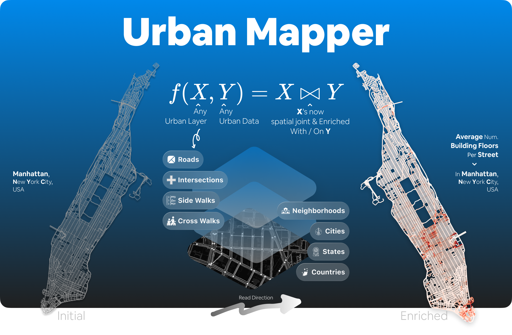

   <h1>UrbanMapper</h1>
   <h3>Enrich Urban Layers Given Urban Datasets</h3>
   
<i>with ease-of-use API and Sklearn-alike Shareable & Reproducible Urban Pipeline</i>

   

      
      
      
      
      
      
   

___

## 🌆 `UrbanMapper` – In a Nutshell

`UrbanMapper` –– $f(\cdot)$ –– brings urban layers (e.g., `Street Roads` / `Intersections` or `Sidewalks` /
`Cross Walks`) –– $X$ –– and your urban datasets –– $Y$ –– together through the function $f(X, Y) = X \bowtie Y$,
allowing you to spatial-join these components and enrich $X$ with attributes, features, and information from $Y$.

While `UrbanMapper` is built with a **Scikit-Learn-like philosophy** – i.e., (I) from `loading` to `viz.` passing by
`mapping` and `enriching`, we want to cover as much as users’ wishes in a welcoming way without having to code 20+/50+
lines of code for one, ~~non-reproducible, non-shareable, non-updatable piece of code;~~ and (II) the library’s
flexibility allows for easy contributions to sub-modules without having to start from scratch _“all the time”_.

This means that `UrbanMapper` is allowing you to build a reproducible, shareable, and updatable urban pipeline in a few
lines of code 🎉 This could therefore be seen as a stepping-stone / accelerator to further analysis such as machine
learning-based ones.

The only thing we request from you is to be sure that your datasets $Y$ are spatial datasets (i.e., with latitude and
longitude coordinates) and let's urban proceed with enriching your urban layer of interests from **insights** your
_datasets_ come with.

## 🗺️ `Urban Layers` Currently Supported

`UrbanMapper` currently supports the following `urban layers`:

1. [x] **Streets Roads** –– `UrbanMapper` can load street road networks from `OpenStreetMap` (OSM) using `OSMNx`.
2. [x] **Streets Intersections** –– `UrbanMapper` can load street intersections from `OpenStreetMap` (OSM) using
   `OSMNx`.
3. [x] **Sidewalks** –– `UrbanMapper` can load sidewalk via `Tile2Net` using Deep Learning for automated mapping of
   pedestrian infrastructure from aerial imagery.
4. [x] **Cross Walks** –– `UrbanMapper` can load crosswalk via `Tile2Net` using Deep Learning for automated mapping of
   pedestrian infrastructure from aerial imagery.
5. [x] **Cities' Features** -- `Urban Mapper` can load OSM cities features such as buildings, parks, Bike Lanes etc. via
   `OSMNx` API.
6. [x] **Region Neighborhoods** –– `UrbanMapper` can load neighborhoods boundaries from `OpenStreetMap` (OSM) using
   `OSMNx` Features
   module.
7. [x] **Region Cities** –– `UrbanMapper` can load cities boundaries from `OpenStreetMap` (OSM) using `OSMNx` Features
   module.
8. [x] **Region States** –– `UrbanMapper` can load states boundaries from `OpenStreetMap` (OSM) using `OSMNx` Features
   module.
9. [x] **Region Countries** –– `UrbanMapper` can load countries boundaries from `OpenStreetMap` (OSM) using `OSMNx`
   Features module.
10. [ ] **Subway/Tube** –– `UrbanMapper` could in the future for instance being able to load subway/tube networks.

More will be added in the future, e.g `Subway`/`Tube` networks, etc. If you have any suggestions, please feel free to
open an issue or a pull request on our GitHub repository.

**References**

- [OSMNx](https://osmnx.readthedocs.io/en/stable/) –– [Tile2Net](https://github.com/VIDA-NYU/tile2net) –– [OSM Cities Features](https://wiki.openstreetmap.org/wiki/Map_features)

___

## 🌆 `UrbanMapper` – Use Cases by `Urban Layer`

`UrbanMapper` is a flexible tool for addressing a wide range of urban analysis challenges. This non-exhaustive list of
practical use cases showcases its capabilities in `transportation`, `safety`, `environment`, `demographics`, and
`urban planning` scenarios among others based on each `urban layer` supported.

!!! warning "Non-Exhaustive Use Cases List"
    Note that these examples are not exhaustive and can be adapted to fit your specific needs. Be imaginative!

=== "🛣️ Streets Roads"

    - **Analyse traffic congestion patterns**  
      Load traffic sensor data, filter by peak hours, and enrich with road type information to visualise congestion on `streets roads`.

    - **Optimise traffic signal timings**  
      Use real-time traffic data to dynamically adjust signal timings on `streets roads`, reducing congestion and improving flow.

    - **Map air pollution levels**  
      Overlay air quality sensor data onto `streets roads` to identify high-pollution zones and target emissions reduction efforts.

=== "🚦Streets Intersections"

    - **Map taxi pickup/dropoff patterns**  
      Analyse taxi activity to identify high-traffic `street intersections` for optimising ride-sharing hubs or traffic flow.

    - **Analyse collision hotspots**  
      Pinpoint `street intersections` with frequent accidents to implement safety measures like better signage or signal adjustments.

    - **Evaluate vehicle wait times**  
      Study wait times at `street intersections` to optimise traffic management and reduce delays.

=== "🚶🚶‍♀️Sidewalks"

    - **Evaluate pedestrian safety**  
      Map accident or complaint data to `sidewalks` to identify hazardous areas needing maintenance or infrastructure upgrades.

    - **Study the effect of sidewalk quality on pedestrian traffic**  
      Correlate pedestrian volume with `sidewalk` conditions (e.g., width, surface quality) to prioritise improvements.

    - **Assess walkability in urban areas**  
      Analyse `sidewalk` networks and proximity to amenities to calculate walkability scores for different zones.

=== "🚷Cross Walks"

    - **Analyse collision hotspots around `cross walks`**  
      Map crash data to `cross walks` to identify accident-prone locations and improve pedestrian safety measures.

    - **Optimise pedestrian signal timings**  
      Use pedestrian traffic data at `cross walks` to adjust signal timings for better flow and safety.

    - **Evaluate crosswalk accessibility**  
      Assess the distribution and condition of `cross walks` to ensure equitable access for all pedestrians.

=== "🌉 Cities' Features"

    - **Assess the impact of `bike lanes` on traffic flow**  
      Study how `bike lanes` affect vehicle speeds and accident rates on adjacent roads.

    - **Plan urban green spaces**  
      Analyse the distribution of `parks` to identify areas lacking accessible green spaces for future development.

    - **Analyse noise pollution near `building footprints`**  
      Overlay noise data onto `building footprints` to identify residential areas needing soundproofing or noise barriers.

=== "🌎Regions Layers"
    
    **🏘️ Neighborhoods**:

    - **Evaluate public transportation coverage**  
      Map transit stops to neighborhoods to identify underserved areas and plan service improvements.
    - **Enrich data with demographic information**  
      Overlay census data on neighborhoods to reveal population trends, income levels, or age distributions for targeted urban planning.
    - **Analyse tourist greenery**  
      Map remarkable trees or green spaces to neighborhoods to assess their impact on tourism and urban greening.
    
    **🌆 Cities**:

    - **Compare urban density**  
      Use building footprints or population data to assess and compare density across cities for regional planning.
    - **Analyse economic activity**  
      Map business locations or employment data to cities to identify economic hubs and growth opportunities.
    - **Study transportation connectivity**  
      Analyse road or rail networks across cities to optimise infrastructure and reduce congestion.
    
    **🌍 States**:

    - **Study environmental impacts**  
      Overlay climate or pollution data across states to compare conditions and plan statewide initiatives.
    - **Analyse transportation networks**  
      Map highway or rail networks across states to optimise connectivity and prioritise infrastructure investments.
    - **Evaluate policy effectiveness**  
      Compare demographic or economic data across states to assess the impact of state-level policies.
    
    **🌐 Countries**:

    - **Analyse global urban trends**  
      Compare urbanization rates or infrastructure development across countries for international studies.
    - **Map international trade routes**  
      Overlay trade data onto countries to visualise global economic connections and dependencies.
    - **Study climate resilience**  
      Analyse temperature changes or natural disaster data across countries to assess vulnerability and plan mitigation strategies.

---

# 📚 Where To Get Started ?

- [Installation](getting-started/installation.md): How to install `UrbanMapper`
- [Getting Started Step By Step](getting-started/quick-start_step_by_step.md): Create your first `UrbanMapper`'s analysis
  step-by-step.
- [Getting Started W/ Pipeline](getting-started/quick-start_pipeline.md): Create your first `UrbanMapper`'s analysis w/
  pipeline.
- [Urban Mapper's Examples](getting-started/examples.md): Understand how the `examples/` folder is structured and how to
  use it.
- [User Guide](user-guide/overview.md): In-depth guides for each component
- [API Reference](api/loaders.md): Complete API documentation
