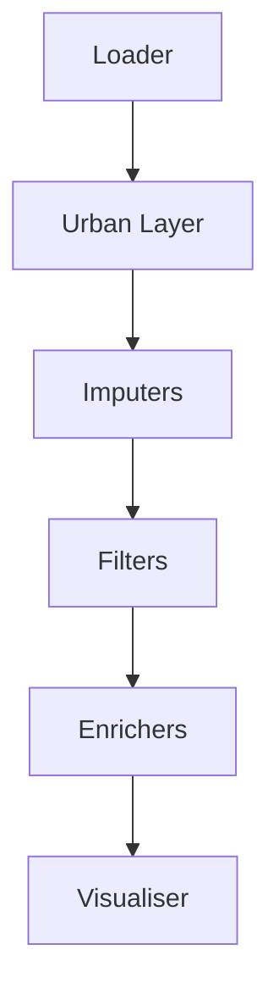

# 🌇 Pipelines: Streamline 🫵 Urban Data Workflow

`Pipelines` in `UrbanMapper` are sequences of components that work together to `process`, `analyse`, and `visualise` urban data.
They provide a way to create `reproducible`, `shareable` analyses, making your workflow smooth and trustworthy. 

Whether you're mapping taxi pickups or analysing urban patterns, pipelines are here to simplify the journey from raw data 
to actionable insights.

## 🏗️ Pipeline Structure

An `UrbanMapper` pipeline is a chain of named components, each handling a specific part of the data processing workflow:

- **Urban Layer** 🏙️: The spatial foundation (e.g., streets, neighborhoods) where your data gets mapped.  
- **Loader** 📦: Loads your geospatial data into the pipeline.  
- **Imputer** 🧹 *(optional)*: Fills in missing geographic data to keep things tidy.  
- **Filter** 🔍 *(optional)*: Narrows down your data based on specific criteria.  
- **Enricher** 📊: Aggregates or analyses data over spatial regions (e.g., counting events or averaging values).  
- **Visualiser** 🖼️: Turns your results into stunning visualisations, like interactive maps.  


`UrbanMapper` ’s pipeline flows could look like this:




---

## 🛠️ Instantiating your first Pipeline

### Basic Pipeline Example

Let’s create a pipeline to analyse `taxi pickups` in `Manhattan`. We’ll `load trip data`, map it to `street intersections`, 
`count pickups` per `intersection`, and `visualise` the results.

```python
from urban_mapper import UrbanMapper
from urban_mapper.pipeline import UrbanPipeline

# Initialise UrbanMapper
um = UrbanMapper()

# Create the urban layer: street intersections in Manhattan
urban_layer = (
    um.urban_layer
    .with_type("streets_intersections")
    .with_mapping(
        longitude_column="pickup_longitude",
        latitude_column="pickup_latitude",
        output_column="nearest_intersection"
    )
    .from_place("Manhattan, New York City, USA")
    .build()
)

# Create the loader: load taxi trip data from a CSV
loader = (
    um.loader
    .from_file("./data/taxi_trips.csv")
    .with_columns(longitude_column="pickup_longitude", latitude_column="pickup_latitude")
    .build()
)

# Create the enricher: count pickups per intersection
enricher = (
    um.enricher
    .with_data(group_by="nearest_intersection")
    .count_by(output_column="pickup_count")
    .build()
)

# Create the visualiser: interactive map
visualiser = (
    um.visual
    .with_type("Interactive")
    .build()
)

# Assemble the pipeline
pipeline = UrbanPipeline([
    ("urban_layer", urban_layer),
    ("loader", loader),
    ("enricher", enricher),
    ("visualiser", visualiser)
])
```
**What’s happening?**:

  - The `urban_layer` defines the spatial context.  
  - The `loader` brings in the raw data.  
  - The `enricher` counts pickups per intersection.  
  - The `visualiser` preps the results for display.  

### Adding Optional Components

Need to clean or refine your data? Add an **imputer** or **filter**:

```python
# Create an imputer to handle missing coordinates
imputer = (
    um.imputer
    .with_type("SimpleGeoImputer")
    .on_columns("pickup_longitude", "pickup_latitude")
    .build()
)

# Create a filter to limit data to the urban layer’s bounding box
filter_step = (
    um.filter
    .with_type("BoundingBoxFilter")
    .build()
)

# Update the pipeline with optional components
pipeline = UrbanPipeline([
    ("urban_layer", urban_layer),
    ("loader", loader),
    ("imputer", imputer),
    ("filter", filter_step),
    ("enricher", enricher),
    ("visualiser", visualiser)
])
```

- **Why optional?**: Use them only when your data needs extra prep.  
- **Order matters**: Imputers clean data before filters refine it.

---

## 🎥 Previewing Your Pipeline

Check your pipeline’s setup before running it:

```python
# Preview in ASCII art
pipeline.preview(format="ascii")

# Preview in JSON for details
pipeline.preview(format="json")
```

- **Why preview?** It’s a quick way to ensure everything’s wired up correctly.

---


## 📍 Execute Your Pipeline

Run your pipeline with the `compose_transform` method, calling both `compose(.)` and `transform(.)` successively:

```python
# Execute the pipeline
mapped_data, enriched_layer = pipeline.compose_transform()

# Check the results
print(f"Mapped data shape: {mapped_data.shape}")
print(f"Enriched layer features: {len(enriched_layer.get_layer())}")
```

**What you get**:

  - `mapped_data`: Your original data with added mapping columns (a `GeoDataFrame`).  
  - `enriched_layer`: The urban layer enriched with aggregated insights (another `GeoDataFrame`).  

---

## 📍 Visualising your Pipeline

Turn your data into a map:

```python
# Visualise a specific column
fig = pipeline.visualise(["pickup_count"])

# Display the map
fig
```

- **Tip**: Visualise multiple columns for a richer view of your data.

---

## 💾 Saving & Loading Pipelines

Save your pipeline for later or share it with others:

```python
# Save
pipeline.save("./taxi_pickup_analysis.dill")

# Load it back (later on for instance)
loaded_pipeline = UrbanPipeline.load("./taxi_pickup_analysis.dill")
```

- **Why save?**: Reuse your workflow or collaborate seamlessly.

---

## 🛠️ Advanced Pipeline Patterns

### Multiple Enrichers

Stack enrichers to calculate multiple metrics:

```python
# Count pickups per intersection
count_enricher = (
    um.enricher
    .with_data(group_by="nearest_intersection")
    .count_by(output_column="pickup_count")
    .build()
)

# Average fare per intersection
avg_fare_enricher = (
    um.enricher
    .with_data(group_by="nearest_intersection", values_from="fare_amount")
    .aggregate_by(method="mean", output_column="avg_fare")
    .build()
)

# Build the pipeline
pipeline = UrbanPipeline([
    ("urban_layer", urban_layer),
    ("loader", loader),
    ("count_enricher", count_enricher),
    ("avg_fare_enricher", avg_fare_enricher),
    ("visualiser", visualiser)
])
```

- **Result**: Your urban layer gets multiple enriched columns (e.g., counts and averages).

### Multiple Mappings

Map multiple coordinate pairs to the same urban layer:

```python
urban_layer = (
    um.urban_layer
    .with_type("streets_intersections")
    .with_mapping(
        longitude_column="pickup_longitude",
        latitude_column="pickup_latitude",
        output_column="pickup_intersection"
    )
    .with_mapping(
        longitude_column="dropoff_longitude",
        latitude_column="dropoff_latitude",
        output_column="dropoff_intersection"
    )
    .from_place("Manhattan, New York City, USA")
    .build()
)
```

More could be retrieve per the `examples` in the `urban_mapper` repository.

___

## ❌ Pipeline is a strict workflow

In `UrbanMapper`, pipelines are composed of specific component types, each with defined roles and constraints. 
The table below outlines the schema for these components, including their class paths and the minimum and maximum number 
of instances allowed. When building a pipeline, you can name your components freely, but they must match the types and 
quantity rules specified here. Think of it as your pipeline blueprint! 🛠️

| Schema Key  | Component Type    | Class Path                                    | Min | Max       |
|-------------|-------------------|-----------------------------------------------|-----|-----------|
| urban_layer | Urban Layer       | `urban_mapper.modules.urban_layer.UrbanLayerBase` | 1   | 1         |
| loader      | Loader            | `urban_mapper.modules.loader.LoaderBase`         | 1   | 1         |
| geo_imputer | Geo Imputer       | `urban_mapper.modules.imputer.GeoImputerBase`    | 0   | unlimited |
| geo_filter  | Geo Filter        | `urban_mapper.modules.filter.GeoFilterBase`      | 0   | unlimited |
| enricher    | Enricher          | `urban_mapper.modules.enricher.EnricherBase`     | 1   | unlimited |
| visualiser  | Visualiser        | `urban_mapper.modules.visualiser.VisualiserBase` | 0   | 1         |

!!! note "Information About The Table Above"
    - **Min** and **Max** indicate the allowed number of components of each type in the pipeline.  
    - A **Min** of `1` means the component is required; `0` means it’s optional.  
    - **unlimited** in the Max column means you can include as many instances as needed—great for stacking multiple enrichers or filters to enhance your analysis.
