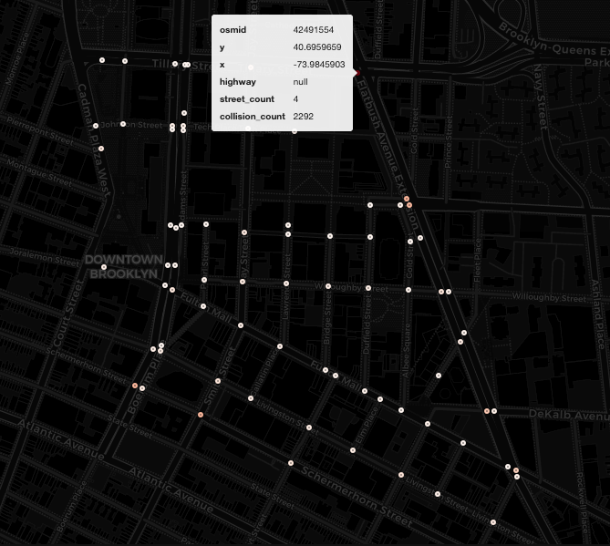

   <h1>Motor Vehicle Collision Analysis in Downtown Brooklyn</h1>
   <h3>Mapping Collisions to Street Networks with UrbanMapper</h3>
    
<i>for urban safety insights</i>

   

      
      
      
      
   

   
Map collision data to Downtown Brooklyn's streets, uncover patterns, and improve urban safety with data-driven insights.

---

  

> [!IMPORTANT]  
> 1) Check out the `/examples/` folder for hands-on Jupyter Notebook tutorials 🎉  
> 2) This study is under active development—expect updates and changes as `UrbanMapper` evolves!

## 🚗 Collision Analysis –– In a Nutshell

This study maps **Downtown Brooklyn motor vehicle collisions** to **street intersections** using `UrbanMapper`. By linking collision data to OpenStreetMap road networks, we reveal hotspots and patterns to enhance urban safety research.

<strong> 👀 What’s Inside? Click here ⬅️</strong>

- **[1] Downtown_BK_Collisions_StepByStep.ipynb**  
  A detailed, step-by-step guide to:
  - Loading collision data.
  - Creating an intersections layer.
  - Imputing missing data.
  - Filtering spatially.
  - Mapping collisions to intersections.
  - Enriching with collision counts.
  - Visualizing results interactively.

- **[2] Downtown_BK_Collisions_Pipeline.ipynb**  
  A streamlined `UrbanPipeline` that automates the entire workflow—from data loading to visualization—in just a few lines.

- **[3] Downtown_BK_Collisions_Advanced_Pipeline.ipynb**  
  An advanced pipeline enriching the layer with multiple metrics, like total injuries and fatalities per intersection.

- **[4] Downtown_BK_Collisions_Advanced_Pipeline_Extras.ipynb**  
  An advanced pipeline enriching the layer with multiple more metrics than [3] by using the custom function from the 
  enricher module allowing us more flexibility but needed more coding.

  As a bonus, we also show how to export the pipeline to [JupyterGIS](https://github.com/geojupyter/jupytergis) 
  for collaborative exploration and visualisation.

Each notebook is modular and easily adaptable to your own geospatial datasets!

---

## 🥐 Getting Started

1. **Install UrbanMapper**: Follow the [installation guide](https://github.com/yourusername/UrbanMapper#installation) in the main repo.
2. **Explore Notebooks**: Open the `/examples/Study Cases` folder in Jupyter to dive into collision data analysis.
3. **Customize**: Tweak the pipelines to analyze collisions or other data in your city of choice!

## 🛣️ Why It Matters

Collisions are a critical urban challenge. This study:
- Pinpoints high-risk intersections accurately.  
- Visualizes trends quickly with interactive maps.  
- Empowers data-driven safety improvements for planners and communities.  

Your analysis could help make streets safer!

---

## 🗺️ Roadmap / Future Work

- **Time-Based Analysis**: Explore collision patterns by time of day or season.
- **Factor Analysis**: Link collisions to road conditions, weather, or other variables.

Got ideas? Fork the repo or suggest features in [issues](https://github.com/yourusername/UrbanMapper/issues)!

---

## Data Sources

- **[NYC DOT Motor Vehicle Collisions](https://data.cityofnewyork.us/Public-Safety/Motor-Vehicle-Collisions-Crashes/h9gi-nx95)**  

---

## Licence

This study is shared under the [MIT Licence](https://github.com/yourusername/UrbanMapper/blob/main/LICENCE).