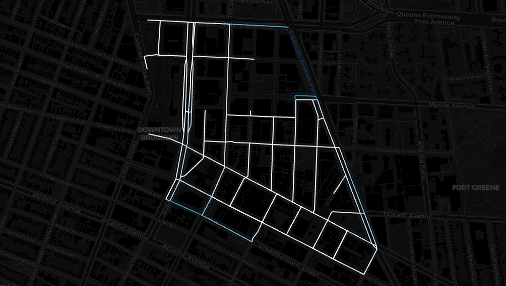

   <h1>Taxi Trip Analysis in Downtown Brooklyn</h1>
   <h3>Mapping Pickups and Dropoffs to Street Segments with UrbanMapper</h3>
    
<i>for urban mobility insights</i>

   

      
      
      
      
   

   
Map taxi pickup and dropoff data to Downtown Brooklyn's street segments, uncover mobility patterns, and enhance urban planning with data-driven insights.

---

  

> [!IMPORTANT]  
> 1) Explore the `/examples/Study Cases` folder for hands-on Jupyter Notebook tutorials 🎉  
> 2) This study is actively evolving—expect updates as `UrbanMapper` develops!

## 🚕 Taxi Trip Analysis –– In a Nutshell

This study maps **taxi pickups and dropoffs** in **Downtown Brooklyn** to **street segments and intersections** using `UrbanMapper`. By integrating taxi trip data with OpenStreetMap street networks, we uncover spatial patterns of urban mobility to inform smarter urban planning.

<strong> 👀 What’s Inside? Click here ⬅️</strong>

- **[1] Downtown_BK_Taxi_Trips_StepByStep.ipynb**  
  A step-by-step tutorial covering:
  - Loading taxi trip data.
  - Creating a street segments layer.
  - Imputing missing coordinates.
  - Filtering to Downtown Brooklyn.
  - Mapping pickups and dropoffs.
  - Enriching with counts.
  - Visualizing results interactively and statically.

- **[2] Downtown_BK_Taxi_Trips_Pipeline.ipynb**  
  A streamlined `UrbanPipeline` automating:
  - Data loading and layer creation.
  - Imputation and filtering.
  - Mapping and enriching with counts.
  - Interactive visualization—all in a concise workflow.

- **[3] Downtown_BK_Taxi_Trips_Advanced_Pipeline.ipynb**  
  An advanced pipeline adding:
  - Enrichment with average fare per segment.
  - Visualization of multiple metrics (e.g., pickup counts, dropoff counts, fares).

- **[4] Downtown_BK_Taxi_Trips_Advanced_Pipeline_Extras.ipynb**  
  An advanced pipeline enriching the layer with multiple more metrics than [3] by using the custom function from the 
  enricher module allowing us more flexibility but needed more coding.

---

## 🥐 Getting Started

1. **Install UrbanMapper**: Follow the [installation guide](https://github.com/yourusername/UrbanMapper#installation).
2. **Prepare Data**: Ensure your taxi trip data includes:
   - `pickup_longitude`, `pickup_latitude`
   - `dropoff_longitude`, `dropoff_latitude`
   - (Optional) `fare_amount` for advanced metrics.
3. **Run Notebooks**: Open `/examples/Study Cases` in Jupyter and start analyzing!

## 🛣️ Why It Matters

Analyzing taxi activity helps cities:
- Identify high-demand streets and intersections.
- Optimize traffic flow and ride-sharing.
- Plan infrastructure with mobility data.

Your insights could shape better urban solutions!

---

## 🗺️ Roadmap / Future Work

- **Temporal Analysis**: Study pickup/dropoff trends by time.
- **Extended Metrics**: Add trip distance or passenger counts.
- **Scalability**: Adapt for larger regions or datasets.

Have suggestions? Fork the repo or share ideas in [issues](https://github.com/yourusername/UrbanMapper/issues)!

---

## Data Sources

- **[Yellow NYC Taxis 2015](https://arc.net/l/quote/pwljlsqk)**: Sample taxi trip data for NYC.

---

## Licence

Shared under the [MIT Licence](https://github.com/yourusername/UrbanMapper/blob/main/LICENCE).