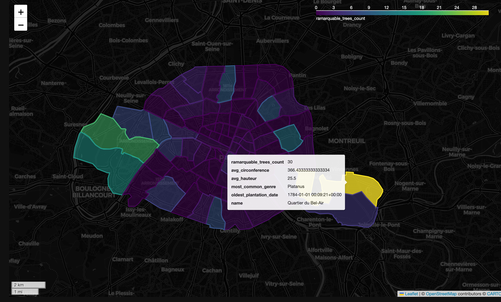

<div align="center">
   <h1>Remarkable Trees in Paris Neighborhoods</h1>
   <h3>Exploring Distribution and Characteristics with UrbanMapper</h3>
    <p><i>for urban greenery insights</i></p>
   <p>
      
      
      
      
   </p>
   <p>Map remarkable trees in Paris to neighborhoods, analyze their distribution and characteristics, and enhance urban planning with data-driven insights into urban greenery.</p>
</div>

---

<div style="text-align: center;">
  
</div>

> [!IMPORTANT]  
> 1) Explore the `/examples/Study Cases` folder for hands-on Jupyter Notebook tutorials 🎉  
> 2) This study is actively evolving—expect updates as `UrbanMapper` develops!

## 🌳 Remarkable Trees Analysis –– In a Nutshell

This study maps **remarkable trees** in **Paris** to **neighborhoods (quartiers)** using `UrbanMapper`. By integrating tree data with OpenStreetMap neighborhood boundaries, we enrich it with metrics like tree count, average size, and historical notes, uncovering spatial patterns of urban greenery to inform smarter urban planning and environmental management.

<details>
<summary><strong> 👀 What’s Inside? Click here ⬅️</strong></summary>

- **[1] Paris_Remarquable_Trees_Pipeline.ipynb**  
  A streamlined `UrbanPipeline` automating:
  - Data loading and neighborhood mapping.
  - Enrichment with metrics like tree count, average circumference, average height, most common genus, and oldest plantation date.
  - Interactive visualization—all in a concise workflow.

- **[2] Paris_Remarquable_Trees_Advanced_Pipeline.ipynb**  
  An advanced pipeline adding:
  - Enrichment with custom metrics, including LLM-generated summaries of tree resumes and descriptions.
  - Exporting to [JupyterGIS](https://github.com/geojupyter/jupytergis) for collaborative exploration and visualization.

</details>

---

## 🥐 Getting Started

1. **Install UrbanMapper**: Follow the [installation guide](https://github.com/VIDA-NYU/UrbanMapper#installation).
2. **Prepare Data**: Ensure your tree data includes:
   - `longitude`, `latitude`
   - `circonference en cm`, `hauteur en m`, `genre`, `date de plantation`, `Résumé`, `Descriptif`
3. **Run Notebooks**: Open `/examples/Study Cases` in Jupyter and start analyzing!

>[!IMPORTANT]
> Make sure that for [2] you have exported your `OPENAI_API_KEY` as an environment variable. You can do this by running the following command in your terminal:
> ```bash
>   export OPENAI_API_KEY="<your_openai_api_key>"
> ```
> Replace `<your_openai_api_key>` with your actual OpenAI API key.
> If you don't have an OpenAI API key, you can sign up for one [here](https://platform.openai.com/signup).

## 🌿 Why It Matters

Analysing remarkable trees helps cities:
- Understand the distribution of urban greenery and trees "landmarks" across the city and its neighborhoods.
- Identify areas with historical or rare tree species.
- Plan for urban biodiversity and green infrastructure.
- Plan touristic routes or educational programs around remarkable trees.

Your insights could contribute to better urban environmental management!

---

## 🗺️ Roadmap / Future Work

- **Temporal Analysis**: Study changes in tree plantation over time.
- **Extended Metrics**: Add biodiversity indices or carbon sequestration estimates.
- **Scalability**: Adapt for other cities or larger datasets.

Have suggestions? Fork the repo or share ideas in [issues](https://github.com/VIDA-NYU/UrbanMapper/issues)!

---

## Data Sources

- **[Paris Open Data - Arbres Remarquables](https://opendata.paris.fr/explore/dataset/arbresremarquablesparis/information/)**: Geo-located remarkable trees in Paris.

---

## Licence

Shared under the [MIT Licence](https://github.com/VIDA-NYU/UrbanMapper/blob/main/LICENCE).

---